# Informe de resultados RA3
## Indice
- [a.) Componentes y funcionamiento de los servicios del servidor](#a-componentes-y-funcionamiento-de-los-servicios-del-servidor)
- [b.) Archivos principales de configuración y bibliotecas compartidas](#b-archivos-principales-de-configuración-y-bibliotecas-compartidas)
- [c.) Cooperación con el servidor web (proxy / reverse proxy) y https](#c-cooperación-con-el-servidor-web-proxy--reverse-proxy-y-https)
- [d.) Mecanismos de seguridad del servidor de aplicaciones](#d-mecanismos-de-seguridad-del-servidor-de-aplicaciones)
- [e.) Componentes web del servidor de aplicaciones](#e-componentes-web-del-servidor-de-aplicaciones)
- [f.) Parámetros necesarios para el despliegue](#f-parámetros-necesarios-para-el-despliegue)
- [g.) Pruebas de funcionamiento y rendimiento](#g-pruebas-de-funcionamiento-y-rendimiento)
- [h.) Documentación de administración y recomendaciones](#h-documentación-de-administración-y-recomendaciones)
- [i.) Virtualización, nube o contenedores en el despliegue](#i-virtualización-nube-o-contenedores-en-el-despliegue)

## a.) Componentes y funcionamiento de los servicios del servidor
Los componentes y servicios que intervienen en el despliegue de P5.2 son los siguientes:
- Contenedor Docker: Es el entorno aislado donde se ejecuta WildFly y la aplicación REST. Proporciona una forma de empaquetar y desplegar la aplicación de manera consistente en diferentes entornos.
- WildFly: Es el servidor de aplicaciones Java EE que se encarga de gestionar la ejecución de la aplicación REST. Proporciona servicios como la gestión de recursos, seguridad, y el contenedor web para servir las peticiones HTTP.
- Aplicación WAR: Es el archivo empaquetado que contiene la aplicación REST. Incluye el código fuente, las dependencias y los archivos de configuración necesarios para que la aplicación funcione correctamente en WildFly.
- Puertos 8080/9990: El puerto 8080 es el puerto estándar para servir aplicaciones web, y es donde WildFly escucha las peticiones HTTP. El puerto 9990 es el puerto de administración de WildFly, utilizado para acceder a la consola de administración y realizar tareas de configuración y monitoreo.
- Endpoint REST: Es la URL específica dentro de la aplicación REST que maneja las peticiones HTTP. Por ejemplo, si la aplicación se despliega con un contexto base de "/app", el endpoint podría ser "http://localhost:8080/app".

Para verificar si el contenedor está activo además de verificar los puertos usa el siguiente comando: `docker ps`
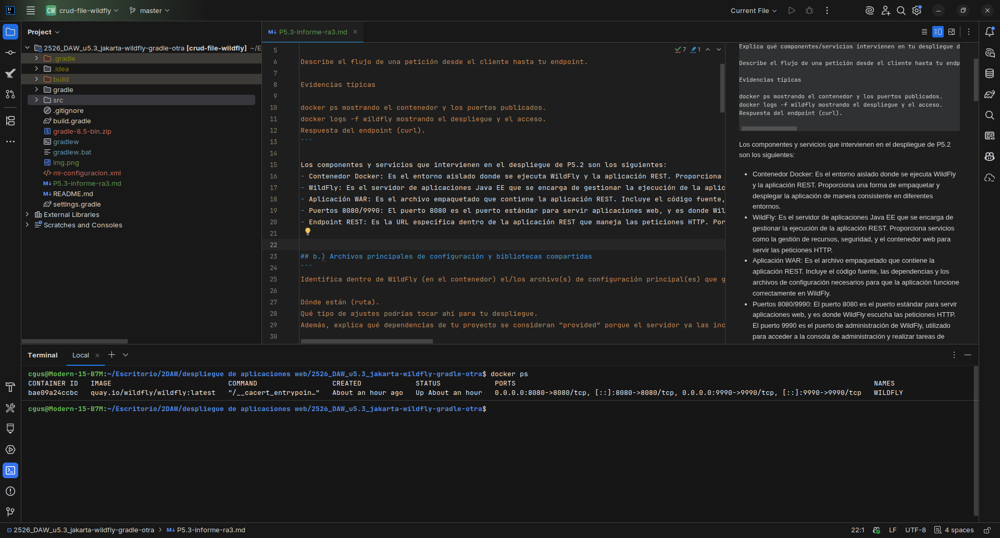
Para verificar los logs del contenedor y el acceso a la aplicación se puede usar el comando: `docker logs -f wildfly`
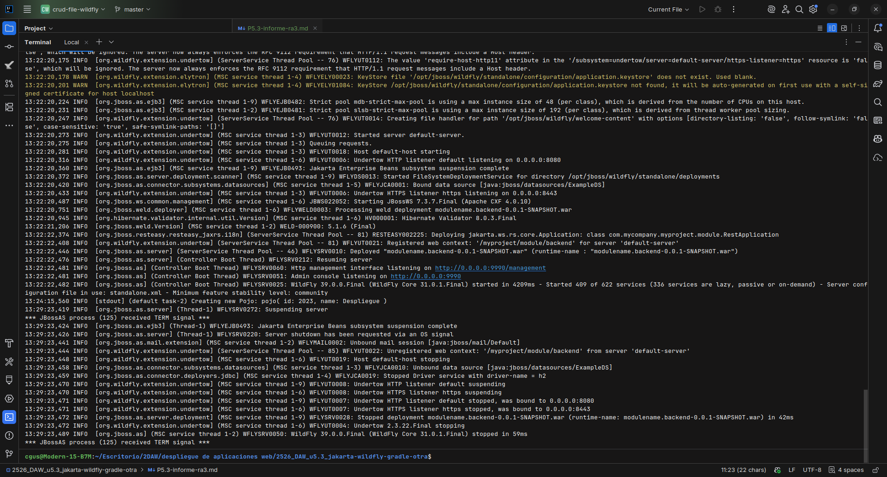
Para verificar la respuesta del endpoint se puede usar el comando: `curl http://localhost:8080/app`
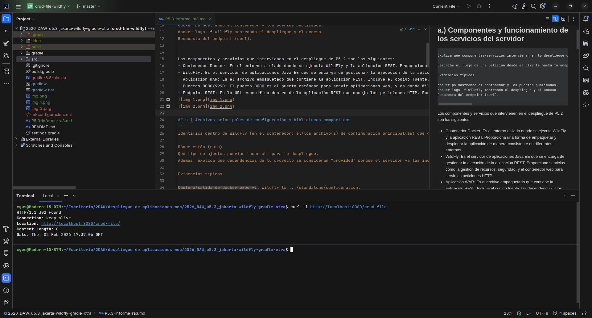

## b.) Archivos principales de configuración y bibliotecas compartidas
Los archivos de configuración principales de WildFly se encuentran en la ruta `/opt/jboss/wildfly/standalone/configuration`. En esta ubicación, se pueden encontrar archivos como `standalone.xml`, que es el archivo de configuración principal del servidor. En este archivo, se pueden ajustar diversos parámetros relacionados con la configuración del servidor, como la gestión de recursos, la seguridad, los subsistemas, y las conexiones a bases de datos, entre otros.
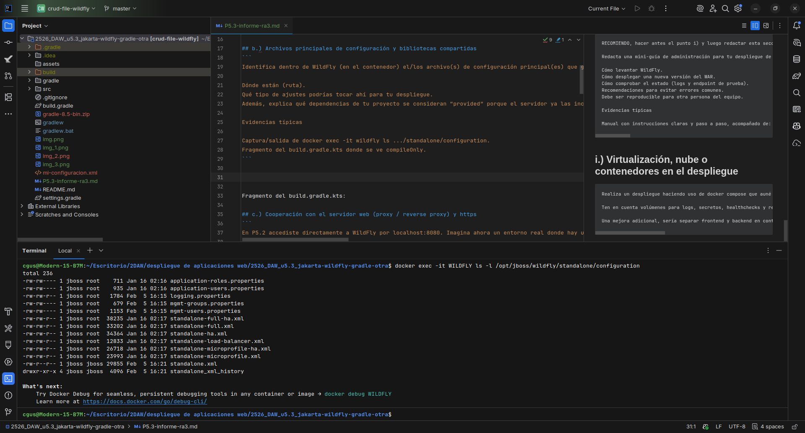

Además, en el archivo `build.gradle.kts` se pueden identificar las dependencias que se consideran "provided", lo que significa que el servidor de aplicaciones ya incluye estas bibliotecas y no es necesario empaquetarlas dentro del WAR. Esto tiene la ventaja de reducir el tamaño del archivo WAR y evitar conflictos de versiones, ya que el servidor se encarga de proporcionar las bibliotecas necesarias en tiempo de ejecución.

!https://github.com/ricitos2001/2526_DAW_u5.3_jakarta-wildfly-gradle-otra/blob/ab23742fc3b5f0f951887e295d474ceac791f83d/build.gradle#L20-L22

## c.) Cooperación con el servidor web (proxy / reverse proxy) y https
En mi despliegue de P5.2, utilicé Nginx como servidor web para actuar como un reverse proxy que redirige las peticiones HTTP y HTTPS hacia el contenedor de WildFly. Nginx se encarga de recibir las solicitudes del cliente, redirigirlas al contenedor de WildFly, y luego enviar la respuesta de vuelta al cliente. Esto permite que WildFly se enfoque en servir la aplicación REST, mientras que Nginx maneja la parte de redirección y seguridad.

La configuración de Nginx para redirigir a WildFly y habilitar HTTPS sería la siguiente:
```Nginx
# File: nginx/default.conf
server {
    listen 80 default_server;
    server_name _;

    # Redirige todo HTTP a HTTPS (mantiene URI y querystring)
    return 301 https://$host$request_uri;
}

server {
    listen 443 ssl default_server;
    server_name _;

    ssl_certificate /etc/nginx/certs/wildfly.crt;
    ssl_certificate_key /etc/nginx/certs/wildfly.key;
    ssl_protocols TLSv1.2 TLSv1.3;
    ssl_ciphers HIGH:!aNULL:!MD5;

    # Si el cliente usó HTTP en el puerto HTTPS, redirigir correctamente
    error_page 497 https://$host$request_uri;

    # Normalizar /crud-file -> /crud-file/
    location = /app {
        return 301 https://$host$request_uri/;
    }

    # Proxy hacia el contenedor WILDFLY en la misma red Docker
    location /app/ {
        proxy_pass http://WILDFLY:8080/app/;
        proxy_set_header Host $host;
        proxy_set_header X-Real-IP $remote_addr;
        proxy_set_header X-Forwarded-For $proxy_add_x_forwarded_for;
        proxy_set_header X-Forwarded-Proto $scheme;
        proxy_http_version 1.1;
        proxy_set_header Connection "";
        proxy_redirect off;
        proxy_connect_timeout 5s;
        proxy_read_timeout 30s;
    }

    location / {
        return 301 https://$host/app/;
    }
}
```

## d.) Mecanismos de seguridad del servidor de aplicaciones
En mi despliegue de P5.2, apliqué las siguientes medidas de seguridad:
1. No expuse el puerto de administración (9990) al exterior, lo que impide que usuarios no autorizados puedan acceder a la consola de administración de WildFly desde fuera del contenedor.
2. Utilicé credenciales seguras para la cuenta de administración de WildFly, asegurándome de que la contraseña sea fuerte y no se utilicen valores predeterminados.
3. Configuré la gestión de secretos utilizando variables de entorno para almacenar las credenciales de administración, evitando incluir información sensible directamente en el código fuente o en archivos de configuración.
4. Configuré el registro y trazabilidad de WildFly para asegurar que todas las actividades relevantes sean registradas en los logs, lo que facilita la detección de posibles intentos de acceso no autorizados o actividades sospechosas.

[NOTA]: En las siguientes caputras de pantalla se muestra la configuración de puertos expuestos en el contenedor Docker, confirmando que solo el puerto 8080 está expuesto al exterior, mientras que el puerto 9990 no lo está, lo que refuerza la seguridad al limitar el acceso a la consola de administración de WildFly, además de un intento de acceso a la consola de administración desde el exterior que resulta en un error de conexión, confirmando que el puerto 9990 no está accesible desde fuera del contenedor.
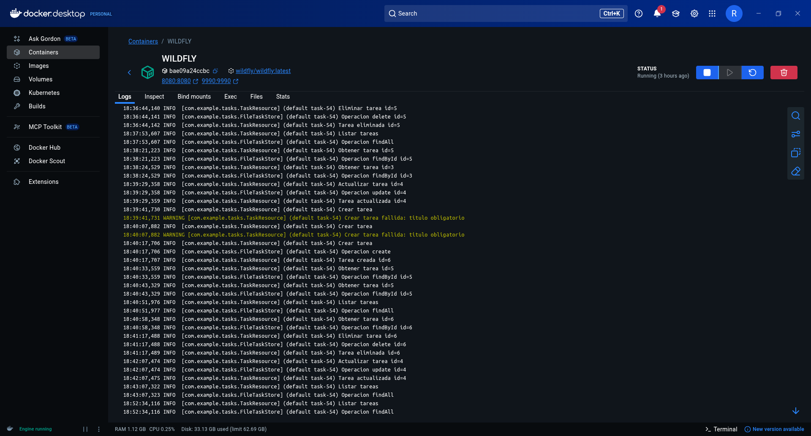
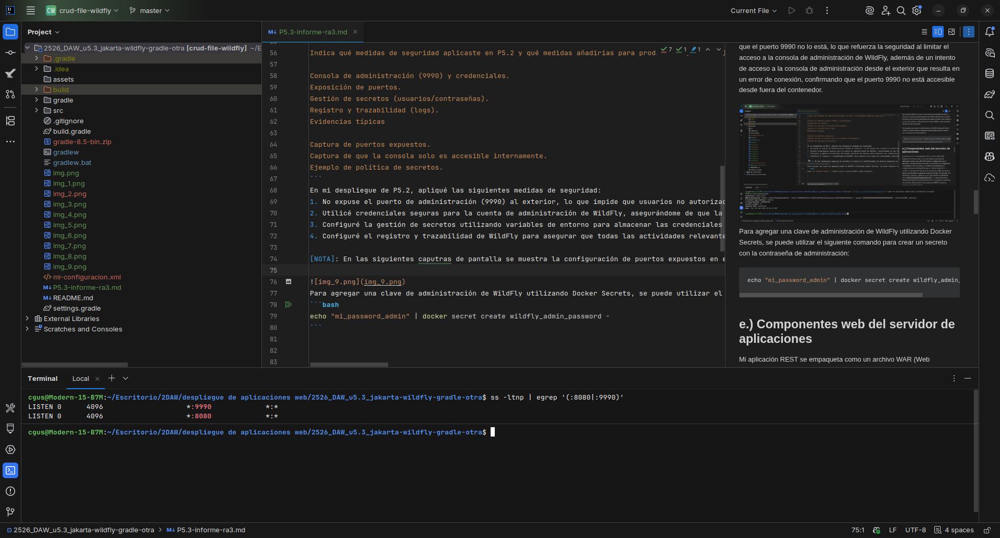
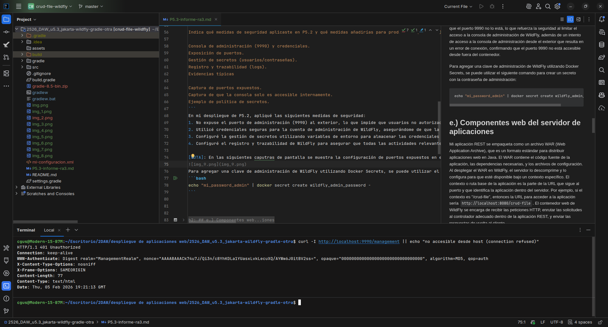
Para agregar una clave de administración de WildFly utilizando Docker Secrets, se puede utilizar el siguiente comando para crear un secreto con la contraseña de administración:
```bash
echo "mi_password_admin" | docker secret create wildfly_admin_password -
```

## e.) Componentes web del servidor de aplicaciones
Mi aplicación REST se empaqueta como un archivo WAR (Web Application Archive), que es un formato estándar para distribuir aplicaciones web en Java. El WAR contiene el código fuente de la aplicación, las dependencias necesarias, y los archivos de configuración. Al desplegar el WAR en WildFly, el servidor lo descomprime y lo configura para que esté disponible bajo un contexto específico. El contexto o ruta base de la aplicación es la parte de la URL que sigue al puerto y que identifica la aplicación dentro del servidor. Por ejemplo, si el contexto es "/crud-file", entonces la URL para acceder a la aplicación sería `http://localhost:8080/crud-file`. El contenedor web de WildFly se encarga de recibir las peticiones HTTP, enrutar las solicitudes al controlador adecuado dentro de la aplicación REST, y enviar las respuestas de vuelta al cliente.
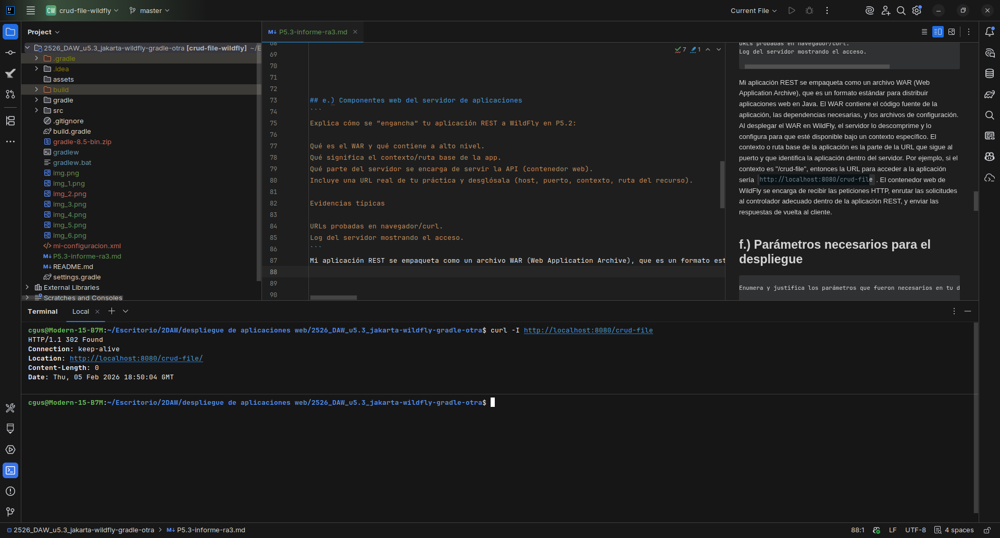

La siguiente imagen muestra el log del servidor WildFly confirmando que la aplicación REST está siendo servida correctamente y que las peticiones a la URL `http://localhost:8080/crud-file/api/tasks` están siendo procesadas sin problemas, lo que indica que el despliegue ha sido exitoso y la aplicación está funcionando como se esperaba.
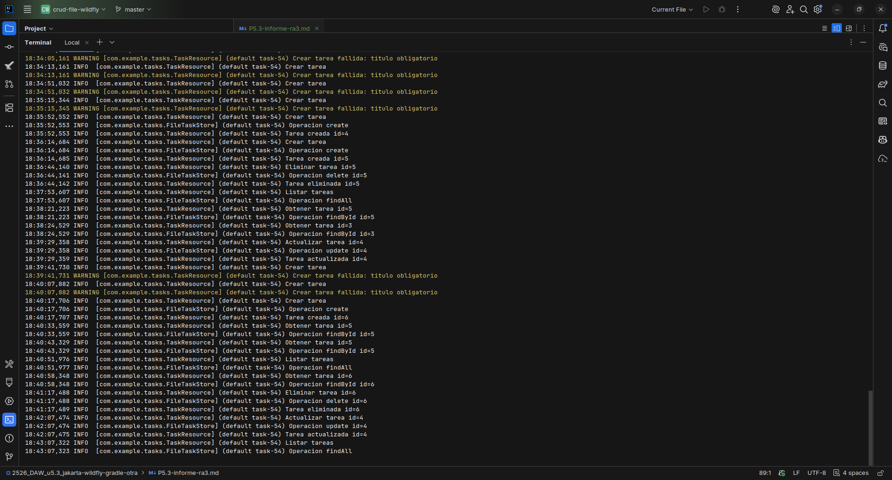

## f.) Parámetros necesarios para el despliegue
Los parametros necesarios en mi despliegue de la práctica 5.2 fueron los siguientes:
1. Nombre del contenedor: Asigné el nombre "wildfly" al contenedor Docker para facilitar su identificación y gestión. Si el nombre estuviera mal, podría resultar difícil identificar el contenedor correcto al ejecutar comandos de Docker, especialmente si hay múltiples contenedores en ejecución.
2. Puertos expuestos: Exposé el puerto 8080 para servir la aplicación REST y el puerto 9990 para la administración de WildFly. Si los puertos estuvieran mal configurados, la aplicación no estaría accesible desde el exterior, y no podría acceder a la consola de administración para realizar tareas de configuración o monitoreo.
3. Ruta de despliegue del WAR: Aseguré que el archivo WAR se desplegara en la ruta correcta dentro de WildFly, lo que permite que la aplicación esté disponible bajo el contexto esperado. Si la ruta de despliegue estuviera mal configurada, la aplicación no estaría accesible a través de la URL prevista, lo que podría causar confusión y dificultar la interacción con la aplicación.
4. Variables de entorno para credenciales: Utilicé variables de entorno para almacenar las credenciales de administración de WildFly, lo que mejora la seguridad al evitar incluir información sensible en el código fuente. Si las variables de entorno estuvieran mal configuradas, podría resultar en la imposibilidad de acceder a la consola de administración o en la exposición de credenciales sensibles, lo que representaría un riesgo de seguridad.
5. Comando de inicio de WildFly: Utilicé el comando `standalone.sh -b 0.0.

El comando utilizado para iniciar el contenedor Docker con WildFly fue el siguiente:
```bash
docker run -d --name wildfly -p 8080:8080 -p 9990:9990 quay.io/wildfly/wildfly:latest /opt/jboss/wildfly/bin/standalone.sh -b 0.0.0.0 -bmanagement 0.0.0.0
```
En caso de que uno de los parámetros este mal escrito o configurado, el contenedor podría no iniciar correctamente, la aplicación no estaría accesible, o podría haber problemas de seguridad. Por ejemplo, si el puerto 8080 no estuviera expuesto correctamente, no se podría acceder a la aplicación REST desde el exterior, lo que impediría su uso. Si el comando de inicio de WildFly estuviera mal configurado, el servidor podría no arrancar o no estar disponible en la dirección correcta, lo que también afectaría la accesibilidad de la aplicación.

## g.) Pruebas de funcionamiento y rendimiento
Realicé pruebas funcionales utilizando curl para verificar que los endpoints de mi aplicación REST estaba respondiendo correctamente. Por ejemplo, ejecuté el siguiente comando para probar el endpoint principal:

```bash
curl -X GET http://localhost:8080/app/api/tasks -H "Content-Type: application/json" -d '{"id":"3"}'
curl -X POST http://localhost:8080/app/api/tasks -H "Content-Type: application/json" -d '{"title":"Aprender curl","done":false}'
curl -X GET http://localhost:8080/app/api/tasks/5
curl -X DELETE http://localhost:8080/app/api/tasks/5
curl -X PUT http://localhost:8080/app/api/tasks/4 -H "Content-Type: application/json" -d '{"title":"Tarea actualizada","done":true}'
```

[NOTA]: En estos comandos, se están probando diferentes métodos HTTP (GET, POST, DELETE, PUT) para interactuar con los recursos de la aplicación REST. Cada comando incluye la URL del endpoint, el método HTTP, y en algunos casos, un cuerpo JSON con los datos necesarios para la operación; además, en las siguientes capturas se muestra el resultado final de cada comando, confirmando que la aplicación REST está funcionando correctamente y respondiendo a las peticiones como se esperaba.
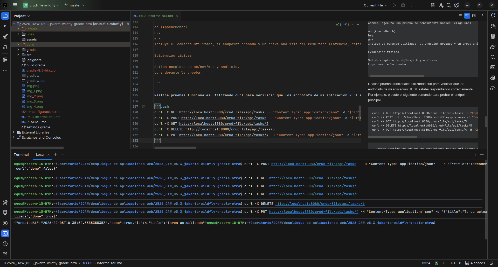
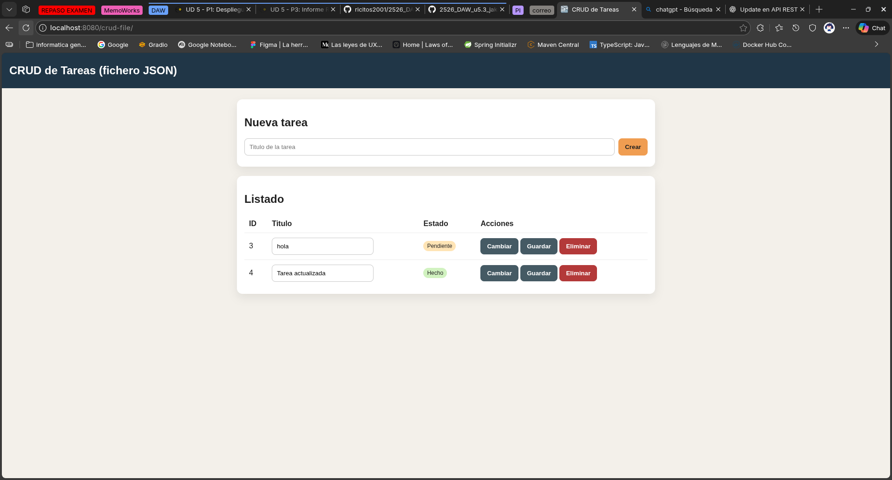

Además, realize una prueba de rendimiento básica utilizando el comando ab (ApacheBench) para evaluar el rendimiento de mi aplicación REST desplegada en WildFly. A continuación, se detallan los comandos utilizados, los endpoints probados y un breve análisis de los resultados obtenidos:
```bash
ab -n 1000 -c 10 http://localhost:8080/app
```

En este comando, se especifica que se realizarán 1000 peticiones (-n 1000) con una concurrencia de 10 peticiones simultáneas (-c 10) al endpoint http://localhost:8080/crud-file:


## h.) Documentación de administración y recomendaciones
Para levantar Wildfly, Primero comprobamos la version de docker:
```bash
docker --version
```

Después descargamos la imagen oficial de WildFly desde el repositorio de Docker utilizando el siguiente comando:
```bash
docker pull quay.io/wildfly/wildfly:latest
```

Después, ejecutamos el contenedor de WildFly utilizando el siguiente comando, asegurándonos de mapear los puertos correctamente para acceder a la aplicación y a la consola de administración:
```bash
docker run -d --name wildfly -p 8080:8080 -p 9990:9990 quay.io/wildfly/wildfly:latest /opt/jboss/wildfly/bin/standalone.sh -b 0.0.0.0 -bmanagement 0.0.0.0
```

Después Creamos un usuario de administración para WildFly utilizando el siguiente comando:
```bash
docker exec -it wildfly /opt/jboss/wildfly/bin/add-user.sh
```

Seleccionamos un tipo usuario de la gestion y se le asigna un usuario y una contraseña (yo recomiendo Management User):
```
What type of user do you wish to add?
a) Management User (mgmt-users.properties)
b) Application User (application-users.properties)
(a):

Enter the details of the new user to add.
Using realm 'ManagementRealm' as discovered from the existing property files.
Username : wildfly

Password recommendations are listed below. To modify these restrictions edit the add-user.properties configuration file.
 - The password should be different from the username
 - The password should not be one of the following restricted values {root, admin, administrator}
 - The password should contain at least 8 characters, 1 alphabetic character(s), 1 digit(s), 1 non-alphanumeric symbol(s)
Password : 
Re-enter Password : 
What groups do you want this user to belong to? (Please enter a comma separated list, or leave blank for none)[  ]: 
About to add user 'wildfly' for realm 'ManagementRealm'
Is this correct yes/no? yes

About to add user 'wildfly' for realm 'ManagementRealm'
Is this correct yes/no? yes
Added user 'wildfly' to file '/opt/jboss/wildfly/standalone/configuration/mgmt-users.properties'
Added user 'wildfly' to file '/opt/jboss/wildfly/domain/configuration/mgmt-users.properties'
Added user 'wildfly' with groups  to file '/opt/jboss/wildfly/standalone/configuration/mgmt-groups.properties'
Added user 'wildfly' with groups  to file '/opt/jboss/wildfly/domain/configuration/mgmt-groups.properties'
```

Después reiniciamos la maquina:
```bash
docker restart wildfly
```

Después preparamos el archivo build.gradle.kts para generar el archivo WAR de nuestra aplicación REST, asegurándonos de incluir las dependencias necesarias y configurar el plugin de empaquetado correctamente:
```
plugins {
    java
    war
}

group = "com.mycompany.myproject"
version = "0.0.1-SNAPSHOT"

repositories {
    mavenCentral()
}

dependencies {
    // Jakarta EE 10 API (Provided porque WildFly ya lo incluye)
    compileOnly("jakarta.platform:jakarta.jakartaee-api:10.0.0")

    // JUnit 5 para tests
    testImplementation("org.junit.jupiter:junit-jupiter:5.10.2")
}

tasks.test {
    useJUnitPlatform()
}


tasks.withType<War> {
    archiveBaseName.set("modulename.backend")
}
```

Comprobamos si tenemos gradle instalado y si no lo tenemos, lo instalamos o usamos el wrapper de gradle para generar el archivo WAR de nuestra aplicación REST:
```bash
gradle --version
# si no lo tenemos instalado, usamos el wrapper de gradle para generar el archivo WAR de nuestra aplicación REST:
sudo apt update
sudo apt install gradle
```

Y finalmente, generamos el archivo WAR utilizando el siguiente comando en la terminal:
```
gradle wrapper
```

En caso de que de errores puede deberse por la version de grandle, por lo que se recomienda actualizar a la version 8.5 y posteriormente utilizar el siguiente comando para evitar problemas de version:
```bash
./gradlew wrapper --gradle-version 8.5
# o tambien:
./gradlew --version
```

Despues generamos el archivo .WAR utilizando el siguiente comando en la terminal:
```bash
./gradlew clean build
```
Una vez que el archivo WAR esté generado, lo copiamos al directorio de despliegue de WildFly utilizando el siguiente comando:
```bash
docker cp build/libs/app.war wildfly:/opt/jboss/wildfly/standalone/deployments/
```

Y comprobamos los logs del contenedor para comprobar si el WAR se ha copiado y la aplicación se ha desplegado correctamente:
```bash
docker logs -f wildfly
```

Ya por último podemos hacer pruebas funcionales utilizando curl para verificar que los endpoints de mi aplicación REST están respondiendo correctamente, además de pruebas de carga y rendimiento cosa que no voy a mencionar aquí, ya que ya lo mencione en otros apartados del informe.

[NOTA]: Si lo que quieres es crear directamente una imagen ve al apartado "i" del informe o si lo que prefieres es saltarte todo el proceso puedes descargar la imagen de docker que he subido a docker hub con el proyecto ya desplegado y ejecutarla utilizando estos comandos:
```bash
docker pull ricitosdeoro2001/wildfly:latest
docker run -d --name wildfly -p 8080:8080 -p 9990:9990 ricitosdeoro2001/wildfly:latest /opt/jboss/wildfly/bin/standalone.sh -b
```

Enlace a la imagen de docker: https://hub.docker.com/r/ricitosdeoro2001/wildfly

## i.) Virtualización, nube o contenedores en el despliegue
Lo primero que tenemos que hacer es crear un archivo `Dockerfile` para construir una imagen personalizada de WildFly con nuestra aplicación REST incluida. El contenido del `Dockerfile` con las instrucciones necesarias para copiar el archivo WAR de nuestra aplicación al directorio de despliegue de WildFly sería el siguiente:
```Dockerfile
###############################################################################
# ETAPA 1: BUILD DEL WAR CON GRADLE
###############################################################################
FROM gradle:8.6-jdk17 AS builder

# Directorio de trabajo dentro del contenedor
WORKDIR /app

# Copiamos el proyecto completo
COPY . .

# Generamos el WAR usando el wrapper si existe
RUN gradle clean build

###############################################################################
# ETAPA 2: WILDFLY + DESPLIEGUE
###############################################################################
FROM quay.io/wildfly/wildfly:latest

# Variables de entorno para el usuario de administración
ENV WILDFLY_USER=wildfly
ENV WILDFLY_PASSWORD=wildfly

# Añadimos usuario de gestión (Management User)
RUN /opt/jboss/wildfly/bin/add-user.sh \
    -u ${WILDFLY_USER} \
    -p ${WILDFLY_PASSWORD} \
    -g '' \
    -s

# Copiamos el WAR generado a deployments
COPY --from=builder \
    /app/build/libs/app.war \
    /opt/jboss/wildfly/standalone/deployments/app.war

# Exponemos puertos
EXPOSE 8080 9990

# Arranque de WildFly con interfaces abiertas
CMD ["/opt/jboss/wildfly/bin/standalone.sh", \
     "-b", "0.0.0.0", \
     "-bmanagement", "0.0.0.0"]

```

[NOTA]: Como es un proyecto de prueba, he utilizado credenciales simples, pero a la hora de desplegar aplicaciones en un entorno real, es fundamental utilizar las credenciales en variables de entorno `.env` además de que las credenciales sean seguras y configurar los archivos `Dockerfile` y `docker-compose.yml` para leer el archivo `.env`y utilizar las variables de entorno.

Después creamos la imagen de Docker utilizando el siguiente comando en la terminal, asegurándonos de estar en el directorio donde se encuentra el `Dockerfile`:
```bash
docker build -t ricitosdeoro2001/wildfly:latest .
```
[NOTA]: ten en cuenta que debes usar tu nombre de usuario no el mio, además de que debes crear un archivo `.dockerignore` para evitar subir archivos a la imagen como el archivo `gradle-8.5-bin.zip`
```dockerignore
.gradle
build
*.zip
wildfly-logs
.idea
```

Una vez que la imagen esté construida creamos el archivo `docker-compose.yml` para definir los servicios de Nginx y WildFly, así como la red y los volúmenes necesarios para la persistencia de datos y logs. El contenido del `docker-compose.yml` sería el siguiente:
```yaml
  version: '3.9'
  services:
    wildfly:
      build:
        context: .
        dockerfile: Dockerfile
      image: ricitosdeoro2001/wildfly:latest
      container_name: WILDFLY
      ports:
        - "8080:8080"
        - "9990:9990"
      networks:
        - appnet
      restart: unless-stopped

    nginx:
      image: nginx:stable-alpine
      container_name: nginx-proxy
      ports:
        - "80:80"
        - "443:443"
      networks:
        - appnet
      volumes:
        - ./default.conf:/etc/nginx/conf.d/default.conf:ro
        - ./certs:/etc/nginx/certs:ro
        - nginx-logs:/var/log/nginx:rw
      depends_on:
        - wildfly
      restart: unless-stopped

  networks:
    appnet:
      external: true

  volumes:
    nginx-logs:
```

Con estos archivos configurados, puedes iniciar los servicios utilizando el siguiente comando en la terminal:
```bash
docker-compose up -d
```